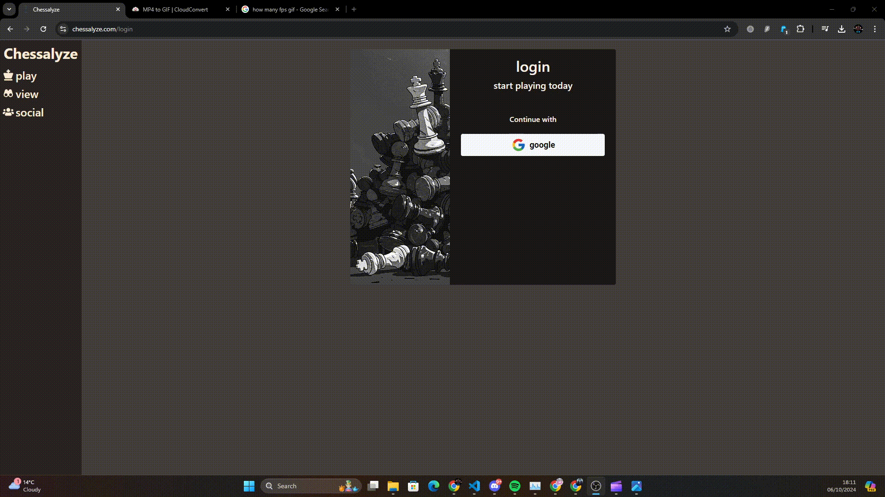
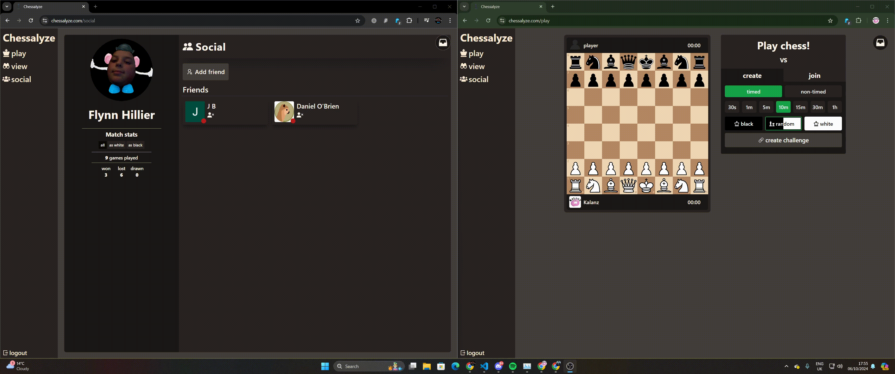
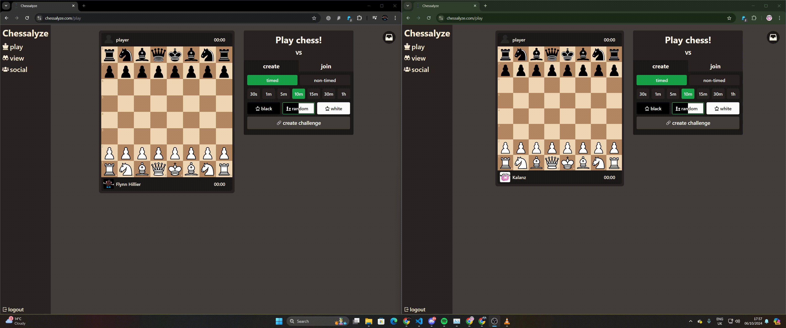
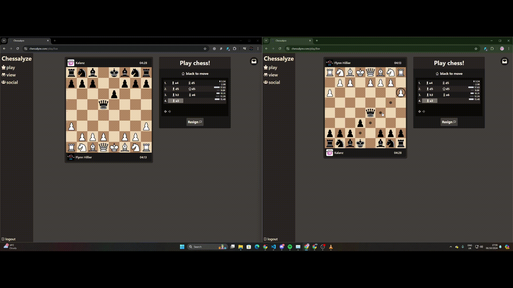

# **Chessalyze** 

## **about**  

Chessalyze is a browser based, multiplayer capable chess website in which you can challenge and play against your friends in real time!

Chessalyze's tech stack consists of the following: **Next 14, tRPC, Drizzle ORM, Lucia Auth & Tailwind CSS**. I created this project in order to experiment and become familar with the afermentioned technologies, and so far I am very happy with what has become of it!

As of 06/10/24 I've got the project to a state I'm happy enough to consider as a finished state. I do not plan on making anymore considerable, if any, changes to the site.

You can find the site hosted live (for now) at <https://chessalyze.com>

**The site is not suitable for viewing on mobile** - for the best experience please view on a computer with a standard viewport.

## **Demo**

Authentication is handled using **Google Oauth**, this way signing up as simple as can be, and user's can rest assure their passwords are secure.

Once we've signed up - let's add our friends! We don't have to do this, we could share a link directly instead.  
In this case, I am going to play against myself - each browser is logged in via different accounts.

Now we've got our friend added - let's challenge them to a game!  
We can configure our game how we'd like. Our friend will have a chance to view these settings before they accept.

From here, we're in our game - now its just chess!
In this case, our white is playing very silly, but we just want the game to finish.

Once our game is over, we can go and step back through the moves, and see the entire movement history.
We can also see games that other people have played.

## **To Do!**

<del>As of writing this updated readme (_09/04/24_) I am still actively working on the project and intend to add a multitude of extra features in the coming months.</del>

As of _06/10/24_ I do not plan on working on this project any longer. It will likely not receieve any future updates.

- <del>More detailed home page & signup screen (soon) </del>
- <del>Retrospective game viewing</del> _completed 22/05/24_
  - <del>view games you've played in the past & step back through the moves that occured</del>
- <del>Directly add friends and in-site invitation's that don't require link sharing</del>
- 'Matchmaking' in which any user on the site can 'queue' for a game and receive a random opponent
- Play against bots!
- <del>**host the site!**</del>

## **Try it yourself**

If you'd like to try and host the site for yourself on your local machine:

- create a `.env` file in the top level directory and fill it with the keys specified in `.env.example`
  - Postgres db url
  - google oauth credentials [get those here](https://developers.google.com/identity/protocols/oauth2)
- install dependencies using `yarn` or `npm install`
- run the `drizzle` script using `npm run drizzle` or `yarn run drizzle`
- start the application using `npm run dev` or `yarn run dev`
- visit `http://localhost:<your port>/play` and get stuck in!
