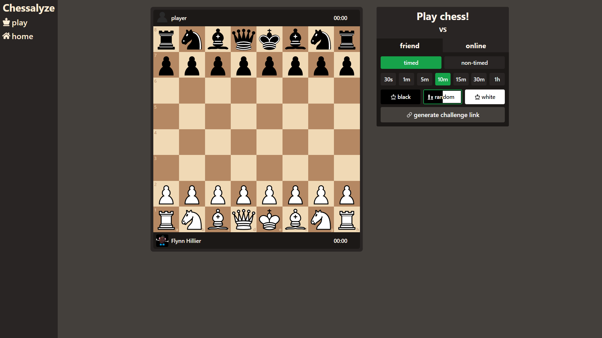
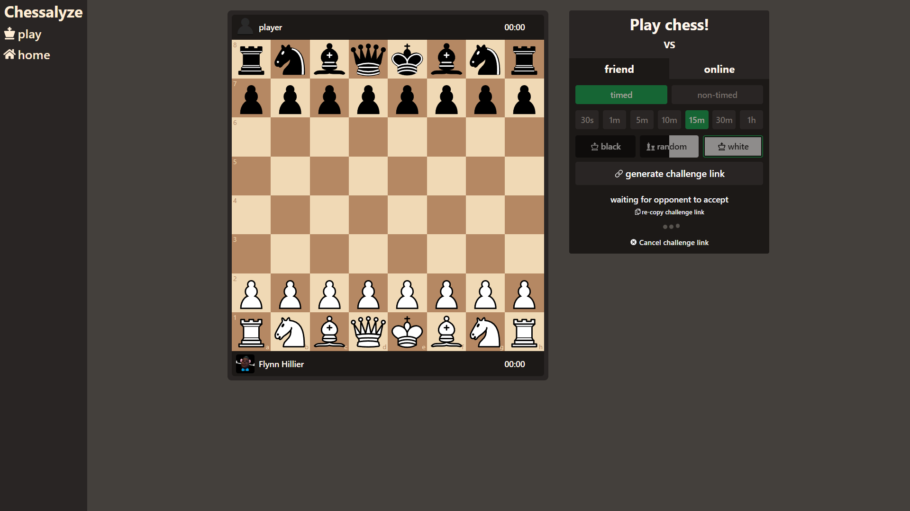
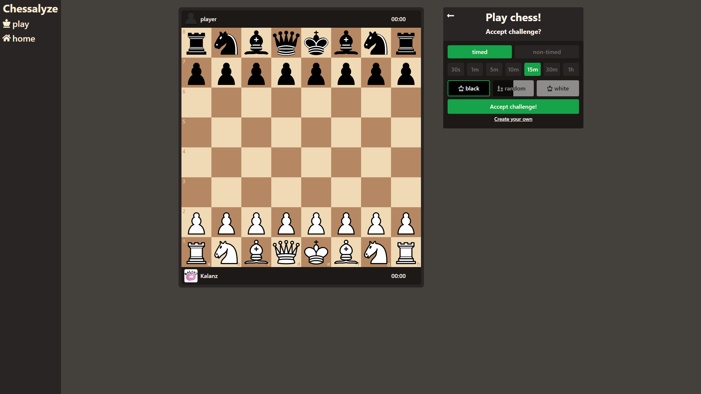
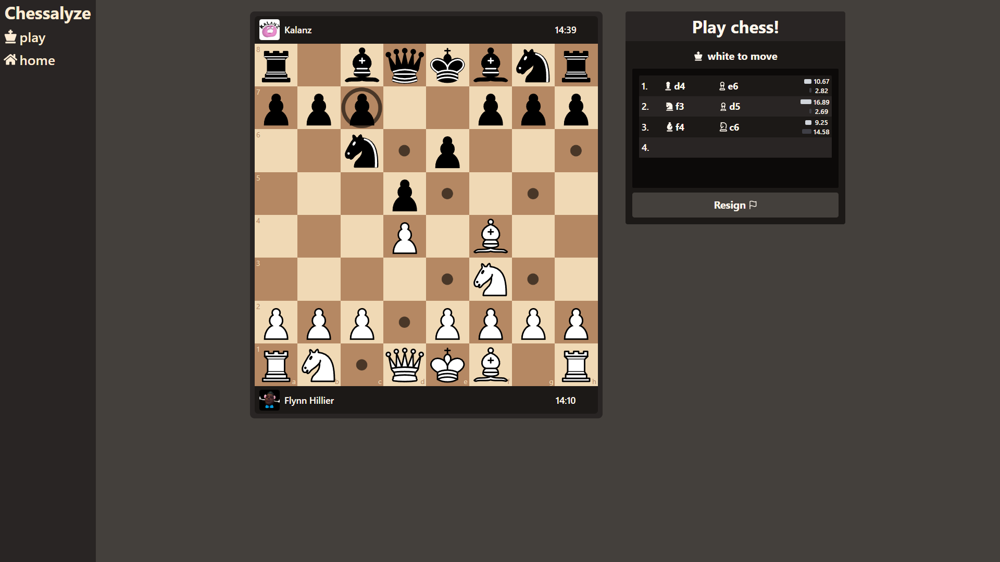

# **Chessalyze** 
**The chess website!**

## **about**  
Chessalyze is a browser based, multiplayer capable chess website in which you can challenge and play against your friends in real time!

Chessalyze's tech stack consists of the following: **Next 14, tRPC, Drizzle ORM, Lucia Auth & Tailwind CSS**. I created this project in order to experiment and become familar with the afermentioned technologies, and so far I am very happy with what has become of it!

## **use**
Authentication is handled using **Google Oauth**, this way signing up as simple as can be, and user's can rest assure their passwords are secure.

Once signed up, simply **create a challenge**:

**Copy the link generated and share it with your friend**. Here they can see the challenge details and can accept if they wish.

**Once they've accepted, it's game on.** From here it's simply the game of chess that we all know and love *(in real time!)*

## **To Do!**
As of writing this updated readme (*09/04/24*) I am still actively working on the project and intend to add a multitude of extra features in the coming months.

- More detailed home page & signup screen (soon)
- Retrospective game viewing 
  - view games you've played in the past & step back through the moves that occured
- Directly add friends and in-site invitation's that don't require link sharing
- 'Matchmaking' in which any user on the site can 'queue' for a game and receive a random opponent
- Play against bots!
- **host the site!**

## **Try it yourself**
If you'd like to try and host the site for yourself on your local machine:

- create a `.env` file in the top level directory and fill it with the keys specified in `.env.example`
  - Postgres db url 
  - google oauth credentials [get those here](https://developers.google.com/identity/protocols/oauth2)
- install dependencies using `yarn` or `npm install`
- run the `drizzle` script using  `npm run drizzle` or `yarn run drizzle`
- start the application using `npm run dev` or `yarn run dev`
- visit `http://localhost:<your port>/play` and get stuck in!

